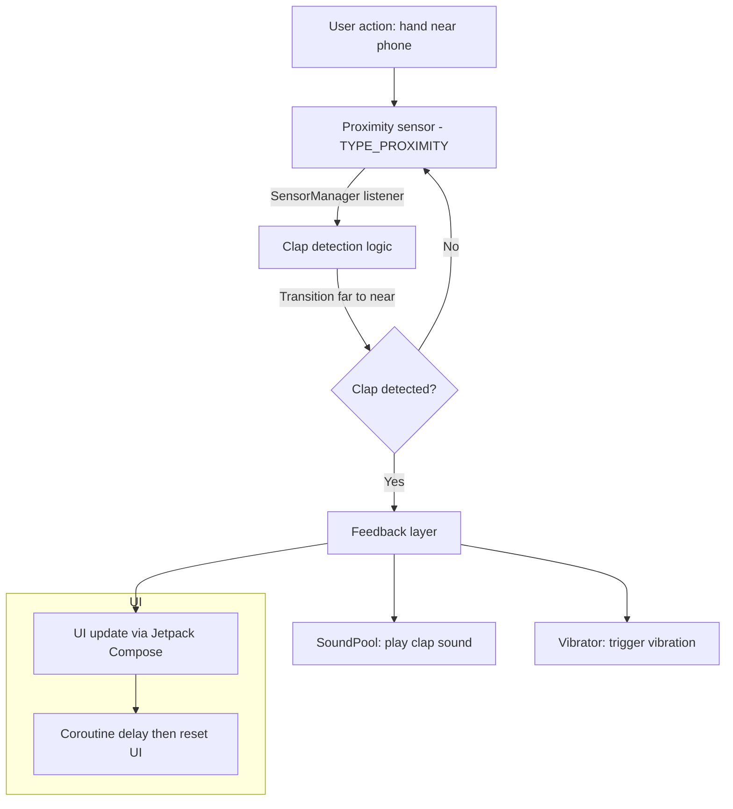

# Android ClapApp 🎵📱

An Android app that detects a “clap” (or more precisely, a transition of a hand near the front of the device) using the proximity sensor, then provides feedback via sound, vibration, and UI changes.

---

## 🧾 Table of Contents

- [About the App](#about-the-app)  
- [Features & Behaviour](#features--behaviour)  
- [Architecture & Design](#architecture--design)  
- [How It Works](#how-it-works)  
- [Setup & Build Instructions](#setup--build-instructions)  
- [Permissions](#permissions)  
- [Project Structure](#project-structure)  
- [Contributors](#contributors)  
- [License](#license)  

---

## About the App

This app demonstrates usage of the **proximity sensor** to detect a “clap-like” trigger—by observing a quick transition from “far” to “near.” Upon detection, it plays a short sound effect, vibrates briefly, and updates the on-screen UI to give visual feedback.

It uses **Jetpack Compose** for the UI, **SoundPool** for low-latency audio, and **Vibrator** for haptic feedback.

---

## Features & Behaviour

- Listens to the device’s proximity sensor (Sensor.TYPE_PROXIMITY).  
- Detects a “clap event” when the sensor transitions from a far value to near (usually 0.0 cm).  
- Triggers feedback:
  - Plays a short sound via **SoundPool**  
  - Vibrates using **Vibrator**  
  - Updates UI image / text to reflect feedback  
- UI resets automatically after a short delay.  
- Uses **MutableState** and **Compose** to reflect live changes.  
- Registers and unregisters sensor listeners cleanly on lifecycle events to conserve resources.

---

## Architecture & Design

- **Sensor Layer**: Proximity sensor, with a threshold-based transition detection logic.  
- **Feedback Layer**: Sound + vibration + UI.  
- **UI Layer**: Jetpack Compose views observing state.  
- **Lifecycle Handling**: Uses `DisposableEffect` and a `LifecycleObserver` to manage sensor listener registration/unregistration.  

---




### Explanation of Flow
- **Proximity Sensor** detects hand movement near the phone.  
- **Clap Detection Logic** checks for a transition (far → near).  
- If a clap is detected:
  - **SoundPool** plays a sound.  
  - **Vibrator** gives haptic feedback.  
  - **UI (Jetpack Compose)** updates image/text, then resets after a short delay.  
- Lifecycle management ensures the sensor listener is registered/unregistered properly:contentReference[oaicite:0]{index=0}.  


## How It Works (Flow)

1. App starts and UI is displayed.  
2. On resume, the proximity sensor listener is registered.  
3. On sensor change:
   - If value transitions from “far” to “near”, a clap is detected.  
   - Trigger sound and vibration.  
   - Update UI (e.g. show “clap” image/text).  
   - After a delay, revert UI to idle state.  
4. On pause, the sensor listener is unregistered to avoid battery drain.

---

## Setup & Build Instructions

1. Clone the repository  
   ```bash
   git clone https://github.com/ananya101001/Android-ClapApp.git
   cd Android-ClapApp
